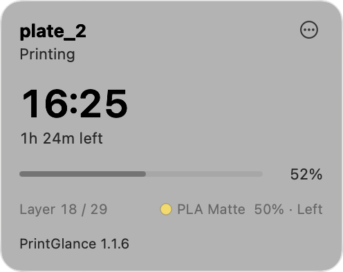

# PrintGlance

PrintGlance is a small icon in the Mac menu bar. While your Bambu printer is printing, it shows how far the job has got and what time it should finish. You do not need Bambu Studio open.

PrintGlance runs on your Mac. It talks to printers on your Wi-Fi. You can watch up to four printers. Once a day it checks GitHub for a newer PrintGlance version. It does not use Bambu's cloud. It does not pause, stop, or start prints. It only asks printers for status and shows it.

  

  

## What you need

- A Mac with macOS 14 or later
- A Bambu printer on the **same Wi-Fi** as the Mac
- The printer's **access code**

## Get the access code from the printer

1. On the printer screen, open **Settings**.
2. Open the **LAN** or **Network** page (the name varies by model).
3. Write down **Access code**.

If **Find printers** does not list the printer, also write down **IP** and **Serial**. If **Serial** is not on that page, look in **Settings** for device info, or on the sticker on the printer.

The Mac and the printer must be on the same Wi-Fi network. Guest Wi-Fi that isolates devices does not work.

## Install PrintGlance

1. Open the [latest PrintGlance release](https://github.com/talic/PrintGlance/releases/latest).
2. Download **PrintGlance.zip** and double-click it to extract it.
3. Drag **PrintGlance** into the **Applications** folder.
4. Open **PrintGlance**. If macOS shows **"PrintGlance" Not Opened**, click **Done**.
5. Open **System Settings > Privacy & Security**. In **Security**, click **Open Anyway**, then click **Open**. Enter your password if macOS asks.
6. If you do not see a printer icon in the menu bar, turn PrintGlance on in **System Settings > Menu Bar**.

## Connect to your printer

1. Click the printer icon in the menu bar.
2. If the printer form is not already open, click **…** and choose **Add printer**.
3. If macOS asks to use the local network, click **Allow**.
4. Click your printer in the list.
5. Enter the access code. Name is optional.
6. Click **Save**.

If no printers appear, click **Find printers**. If the list is still empty, enter the IP address, serial number, and access code from the printer.

When a print is running, the menu bar shows percent and finish time. If the job finishes after today, the time includes the day. Click the icon for more detail: layer, the filament in use, and remaining filament. On a dual-nozzle printer such as H2D, the card shows **Left** or **Right** next to the filament.

The print card and the printer form show **PrintGlance** and the version you are running.

To add another printer, click **…** and choose **Add printer**. PrintGlance watches up to four printers. Click a printer in the list to focus it. To change or remove the focused printer, click **…** and choose **Printer**. **Remove** is available when more than one printer is saved.

The access code stays on this Mac. PrintGlance does not send it to the internet.

To start PrintGlance when you log in, click **…** and turn on **Open at Login**. To quit, click **…** and choose **Quit**.

## Turn on notifications

Click **…** and open **Notifications**. Turn on the events you want:

- **Print finished**
- **Print failed**
- **Print paused**
- **Printer went offline**

**Print finished**, **Print failed**, and **Printer went offline** start turned on. **Print paused** starts turned off.

When macOS asks for notification permission, click **Allow**. PrintGlance asks the first time a print starts.

PrintGlance also sends a **Low filament** notice when the spool in use drops below 20% while a print is starting or running. That notice is not in the **Notifications** menu.

## Update PrintGlance

Once a day PrintGlance checks GitHub. When a newer version is on GitHub, the print card shows **Update available**.

1. Click **Update available**, or click **…** and choose **Download update**.
2. Download **PrintGlance.zip** and double-click it to extract it.
3. Drag **PrintGlance** into the **Applications** folder. Replace the existing app when macOS asks.
4. Open **PrintGlance**. If macOS shows **"PrintGlance" Not Opened**, click **Done**.
5. Open **System Settings > Privacy & Security**. In **Security**, click **Open Anyway**, then click **Open**.

Your printer IP, serial, and access code stay on this Mac.

## If it cannot connect

- Mac and printer are on the same Wi-Fi
- Access code matches the printer's LAN or Network page
- The printer is switched on
- PrintGlance is turned on for the local network in **System Settings > Privacy & Security > Local Network**
- If you entered the IP address, it matches the printer's LAN or Network page

## License

MIT. See the `LICENSE` file.
