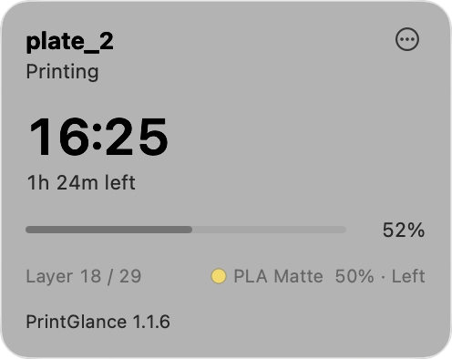

# PrintGlance

PrintGlance is a small icon in the Mac menu bar. While your Bambu printer is printing, it shows how far the job has got and what time it should finish. You do not need Bambu Studio open.

PrintGlance runs on your Mac. It talks to printers on your Wi-Fi. You can watch up to four printers. Once a day it checks GitHub for a newer PrintGlance version. It does not use Bambu's cloud. It does not pause, stop, or start prints. It only asks printers for status and shows it.

  

  

## What you need

- A Mac with macOS 14 or later
- A Bambu printer on the **same Wi-Fi** as the Mac
- The printer's **access code**

## Get the access code from the printer

1. On the printer screen, open **Settings**.
2. Open the **LAN** or **Network** page (the name varies by model).
3. Write down **Access code**.

If **Find printers** does not list the printer, also write down **IP** and **Serial**. If **Serial** is not on that page, look in **Settings** for device info, or on the sticker on the printer.

The Mac and the printer must be on the same Wi-Fi network. Guest Wi-Fi that isolates devices does not work.

## Install PrintGlance

1. Open the [latest PrintGlance release](https://github.com/talic/PrintGlance/releases/latest).
2. Download **PrintGlance.zip** and double-click it to extract it.
3. Drag **PrintGlance** into the **Applications** folder.
4. Open **PrintGlance**. If macOS shows **"PrintGlance" Not Opened**, click **Done**.
5. Open **System Settings > Privacy & Security**. In **Security**, click **Open Anyway**, then click **Open**. Enter your password if macOS asks.
6. If you do not see a printer icon in the menu bar, turn PrintGlance on in **System Settings > Menu Bar**.

PrintGlance has no Dock icon. If it is already running, click the printer icon in the menu bar.

## Connect to your printer

1. Click the printer icon in the menu bar.
2. If the printer form is not already open, click **…** and choose **Add Printer…**.
3. If macOS asks to use the local network, click **Allow**.
4. Click your printer in the list.
5. Enter the access code. Name is optional.
6. Click **Save**.

If no printers appear, click **Find printers**. If the list is still empty, enter the IP address, serial number, and access code from the printer.

The access code stays on this Mac. PrintGlance does not send it to the internet.

To see which version you are running, click **…**. The version is near the bottom of the menu.

## Watch a print

Click the printer icon to open the print card.

| Printer | Menu bar | Print card |
|---|---|---|
| Starting | The stage: **Heating**, **Leveling**, **Loading**, **Unloading**, **Calibrating**, **Cleaning**, **Homing**, or **Starting** | The full stage, such as **Loading filament**, plus the finish time and time left when the printer sends them |
| Printing | Percent and finish time | Finish time, time left, percent, layer, filament name, remaining filament, and color. On a dual-nozzle printer such as H2D, **Left** or **Right** next to the filament |
| Paused | A pause icon and percent | Time left (not a finish time, because it moves while paused), percent, layer, and the AMS trays. The error code, such as **Error 0700-2000-0002-0001**, with **Look up** to open Bambu's page for it in your browser, or **No error reported.** |
| Finished | A checkmark and how long ago it finished, such as **40m ago**. After 2 hours, only the checkmark | How long ago it finished, the printer name, and the AMS trays. If PrintGlance was not running when the print finished, no elapsed time |
| Failed | An X | **Failed**, the error code with **Look up**, and the AMS trays. The **Print Failed** notice ends with the error code |
| Idle | A printer icon | The printer name and each loaded slot, named like the printer screen (**A1**…**D4**, **HT-A**, **External**): color, filament, and remaining percent. Slots sit under a header such as **AMS A · Dry** or **AMS B · 23%** when there is more than one AMS or the AMS reports humidity |
| Offline | A Wi-Fi icon with a slash | When PrintGlance last heard from the printer, such as **Last update 14:02**, and what it was doing: **Was printing · 52% · Layer 18 / 29** with **Expected to finish 16:25**, or **Was paused at 52%**. Then why PrintGlance cannot reach the printer, when it knows |

Times follow your Mac's 12- or 24-hour setting. If the job finishes after today, the finish time includes the day, such as **4:25 PM tomorrow**.

## Watch more than one printer

PrintGlance watches up to four printers. To add one, click **…** and choose **Add Printer…**.

The menu bar shows the printer that needs you most:

1. A paused printer
2. A printing or starting printer. If several are printing, the one you last clicked, otherwise the one finishing soonest
3. A failed printer
4. A finished printer
5. The printer you last clicked, otherwise the first one

The print card opens on the same printer. Click another printer in the list to see it. The next time you open the card, it shows the menu bar's printer again.

To change or remove the printer on the card, click **…** and choose **Edit** followed by the printer's name. **Remove** is available when more than one printer is saved.

## See recent prints

To see recent prints, click **…** and choose **History**. PrintGlance keeps the last 50 jobs on this Mac, newest first. Each row shows the job name, when it started (such as **14:02 yesterday**), how long it took when PrintGlance saw it start and finish, and **Finished**, **Failed**, or **Printing**. Failed prints are red. With more than one printer, each row also names the printer.

To save the list, click **Export CSV**. To return to the print card, click the back arrow next to **History**, or press Esc.

## Turn on notifications

Click **…** and open **Notifications**. Turn on the events you want:

- **Print Paused**
- **Print Failed**
- **Print Finished**
- **Print Finishing Soon**
- **Printer Went Offline**
- **Quiet Hours**

**Quiet Hours** starts turned off. The others start turned on. **Print Paused** and **Print Failed** end with the error code when the printer sends one.

**Print Finishing Soon** tells you about 10 minutes before the print ends, so you can be at the printer. Pause or a lost connection cancels that notice until printing resumes. If the print ends first, that notice is cancelled.

**Quiet Hours** (10 PM to 7 AM on this Mac) delays **Print Finished** until 7 AM. **Print Finishing Soon** is skipped in that window. **Print Failed**, **Print Paused**, **Printer Went Offline**, and **Low filament** still appear.

When macOS asks for notification permission, click **Allow**. PrintGlance asks the first time a print starts.

PrintGlance also sends a **Low filament** notice when the spool in use drops below 20% while a print is starting or running. That notice is not in the **Notifications** menu.

Notices stay on this Mac. They do not appear on iPhone.

## Start PrintGlance when you log in

To start PrintGlance when you log in, click **…** and turn on **Open at Login**. To quit, click **…** and choose **Quit PrintGlance**.

## Update PrintGlance

Once a day PrintGlance checks GitHub. When a newer version is on GitHub, the print card shows **Update available**.

1. Click **Update available**, or click **…** and choose **Download PrintGlance** followed by the new version number.
2. Download **PrintGlance.zip** and double-click it to extract it.
3. Drag **PrintGlance** into the **Applications** folder. Replace the existing app when macOS asks.
4. Open **PrintGlance**. If macOS shows **"PrintGlance" Not Opened**, click **Done**.
5. Open **System Settings > Privacy & Security**. In **Security**, click **Open Anyway**, then click **Open**.

Your printer IP, serial, and access code stay on this Mac.

## If it cannot connect

- Mac and printer are on the same Wi-Fi
- The printer is switched on and has finished starting up
- Access code matches the printer's LAN or Network page
- PrintGlance is turned on for the local network in **System Settings > Privacy & Security > Local Network**
- If you entered the IP address, it matches the printer's LAN or Network page

You do not need **LAN Only Mode** or **Developer Mode**. PrintGlance only reads status, which Bambu allows while the printer is connected to Bambu's cloud. LAN Only Mode turns off Bambu Handy and printing from outside your network.

## License

MIT. See the `LICENSE` file.
