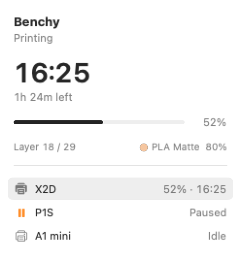
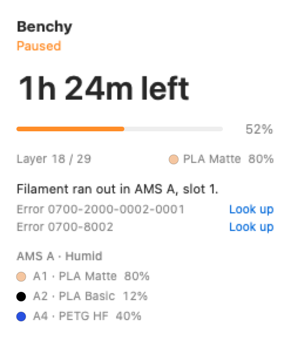

# PrintGlance

See your Bambu Lab print's progress and finish time in the Mac menu bar. You do not need Bambu Studio, Bambu's cloud, or an account.

  <a href="https://github.com/talic/PrintGlance/releases/latest"><b>Download PrintGlance</b></a> · Free · macOS 14 or later

  

  <picture>
    <source media="(prefers-color-scheme: dark)" srcset="docs/print-card-dark.png">
    
  </picture>
  &nbsp;&nbsp;
  <picture>
    <source media="(prefers-color-scheme: dark)" srcset="docs/paused-card-dark.png">
    
  </picture>

- **Glance at the menu bar.** It shows the percent and finish time. While a print starts, it shows the stage, such as **Heating** or **Leveling**.
- **Know why a print stopped.** When a print pauses or fails, PrintGlance says why in plain words, such as **Filament ran out in AMS A, slot 2.** It also shows the error code, with a link to Bambu's page about it.
- **Get notified.** When a print is finishing soon, finishes, pauses, or fails, when PrintGlance loses the printer, and when filament runs low. **Quiet Hours** holds the finish notice until morning.
- **Watch up to four printers.** The menu bar shows the one that needs you. The print card lists them all.
- **See your filament.** Each AMS slot shows its color, filament, and how much is left, plus the AMS humidity when the AMS reports it.
- **Private and read-only.** PrintGlance talks to your printers on your Wi-Fi. It never pauses, stops, or starts a print. Your access code stays on your Mac. The only thing it fetches from the internet is a daily check on GitHub for a newer version.

PrintGlance works with Bambu Lab printers that show an access code on their LAN or Network page, such as the A1, P1, P2S, X1, H2, and X2D.

## What you need

- A Mac with macOS 14 or later
- A Bambu printer on the **same Wi-Fi** as the Mac
- The printer's **access code**

## Get the access code from the printer

1. On the printer screen, open **Settings**.
2. Open the **LAN** or **Network** page (the name varies by model).
3. Write down **Access code**.

If PrintGlance does not find the printer, also write down **IP** and **Serial**. If **Serial** is not on that page, look in **Settings** for device info, or on the sticker on the printer.

The Mac and the printer must be on the same Wi-Fi network. Guest Wi-Fi that isolates devices does not work.

## Install PrintGlance

1. Open the [latest PrintGlance release](https://github.com/talic/PrintGlance/releases/latest).
2. Download **PrintGlance.zip** and double-click it to extract it.
3. Drag **PrintGlance** into the **Applications** folder.
4. Open **PrintGlance**. If macOS shows **"PrintGlance" Not Opened**, click **Done**.
5. Open **System Settings > Privacy & Security**. In **Security**, click **Open Anyway**, then click **Open**. Enter your password if macOS asks.
6. The **Add Printer** window opens. Continue with [Connect to your printer](#connect-to-your-printer).

PrintGlance has no Dock icon. It lives in the menu bar as a printer icon. If you do not see the icon, turn PrintGlance on in **System Settings > Menu Bar**.

## Connect to your printer

The **Add Printer** window opens the first time you open PrintGlance, and whenever you open the app while no printer is set up. To add another printer, click the printer icon in the menu bar, click **…**, and choose **Add Printer…**.

1. If macOS asks to use the local network, click **Allow**.
2. Under **Printers on this Wi-Fi**, click your printer. A printer you already added shows **Added**.
3. Enter the **Access code** from the printer's screen. **Name** is optional.
4. Click **Connect**.

PrintGlance waits for the printer to answer. When the window shows **Connected**, the printer is set up. After your first printer, the window says PrintGlance is in your menu bar and offers **Open at login**, which starts turned on. Click **Done**. When macOS asks to send notifications, click **Allow**.

If your printer is not in the list, click **Search Again**. If it still does not appear, click **Enter IP and serial instead**, then type the IP address and serial number from the printer.

If the printer does not connect, the window says why, such as **The access code was rejected.** Fix the entry and click **Try Again**. To leave without adding the printer, click **Cancel**.

To change a printer's access code or IP address later, click **…** and choose **Edit** followed by the printer's name. To remove it, click **Remove…** in that window. If the printer rejects its access code, the print card shows **Update Access Code…**, which opens the same window.

The access code stays on this Mac. PrintGlance does not send it to the internet.

To see which version you are running, click **…**. The version is near the bottom of the menu.

## Watch a print

Click the printer icon to open the print card.

| Printer | Menu bar | Print card |
|---|---|---|
| Starting | The stage: **Heating**, **Leveling**, **Loading**, **Unloading**, **Calibrating**, **Cleaning**, **Homing**, or **Starting** | The full stage, such as **Loading filament**, plus the finish time and time left when the printer sends them. How far the heaters have got, such as **Nozzle 186 / 220° · Bed 48 / 60°**, and the chamber while it heats. On a dual-nozzle printer, the nozzle shown is the one in use |
| Printing | Percent and finish time | Finish time, time left, percent, layer, filament name, remaining filament, and color. On a dual-nozzle printer such as H2D, **Left** or **Right** next to the filament. If a spool looks set to run out first, an orange mark on the progress bar where it should run out and a line such as **PLA Matte in A2 runs out around 15:45.** |
| Paused | A pause icon and percent | Time left (not a finish time, because it moves while paused), percent, layer, and the AMS trays. For common problems, a short reason, such as **Filament ran out in AMS A, slot 2.** Then the error code, such as **Error 0700-2100-0002-0001**, with **Look up** to open Bambu's page for it in your browser, or **No error reported.** |
| Finished | A checkmark and how long ago it finished, such as **40m ago**. After 2 hours, only the checkmark | How long ago it finished, the printer name, and the AMS trays. If PrintGlance was not running when the print finished, no elapsed time |
| Failed | An X | **Failed**, a short reason for common problems, the error code with **Look up**, and the AMS trays. The **Print Failed** notice starts with the reason and ends with the error code |
| Idle | A printer icon | The printer name and each loaded slot, named like the printer screen (**A1**…**D4**, **HT-A**, **External**): color, filament, and remaining percent. Slots sit under a header such as **AMS A · Dry** or **AMS B · 23%** when there is more than one AMS or the AMS reports humidity |
| Offline | A Wi-Fi icon with a slash | When PrintGlance last heard from the printer, such as **Last update 14:02**, and what it was doing: **Was printing · 52% · Layer 18 / 29** with **Expected to finish 16:25**, or **Was paused at 52%**. Then why PrintGlance cannot reach the printer, when it knows |

Times follow your Mac's 12- or 24-hour setting. If the job finishes after today, the finish time includes the day, such as **4:25 PM tomorrow**.

## Watch more than one printer

PrintGlance watches up to four printers. To add one, click **…** and choose **Add Printer…**.

The menu bar shows the printer that needs you most:

1. A paused printer
2. A printing or starting printer. If several are printing, the one you last clicked, otherwise the one finishing soonest
3. A failed printer
4. A finished printer
5. The printer you last clicked, otherwise the first one

The print card opens on the same printer. Below it, each printer has a row, in the order you added them. A printing row shows the percent and finish time, such as **52% · 4:25 PM**. Other rows show the state, such as **Paused** or **Idle**. A paused printer's icon is orange, and a failed printer's icon is red.

Click a row to see that printer on the card. The next time you open the card, it shows the menu bar's printer again.

To change or remove a printer, Control-click its row and choose **Edit…** or **Remove…**. PrintGlance asks before it removes a printer.

## See recent prints

To see recent prints, click **…** and choose **History**. PrintGlance keeps the last 50 jobs on this Mac, newest first. Each row shows the job name, when it started (such as **14:02 yesterday**), how long it took when PrintGlance saw it start and finish, and **Finished**, **Failed**, or **Printing**. Failed prints are red. With more than one printer, each row also names the printer.

To save the list, click **Export CSV**. To return to the print card, click the back arrow next to **History**, or press Esc.

## Turn on notifications

Click **…** and open **Notifications**. Turn on the events you want:

- **Print Paused**
- **Print Failed**
- **Print Finished**
- **Print Finishing Soon**
- **Lost Connection**
- **Low Filament**
- **Quiet Hours**, shown with its hours, such as **Quiet Hours (10 PM–7 AM)**

**Quiet Hours** starts turned off. The others start turned on. **Print Paused** and **Print Failed** start with a short reason for common problems, such as **Filament ran out in AMS A, slot 2.** They end with the error code when the printer sends one.

**Print Finishing Soon** tells you shortly before the print ends, so you can be at the printer. To choose how early, open **Lead Time** under it and choose **5 Minutes**, **10 Minutes**, **15 Minutes**, or **30 Minutes**. It starts at 10 minutes. If less time is left when PrintGlance first sees the print, the notice comes right away and says how much is left. Pause or a lost connection cancels that notice until printing resumes. If the print ends first, that notice is canceled.

**Lost Connection** tells you when PrintGlance stops hearing from a printer during a print, such as **Lost connection to X2D** with **Benchy was at 52%. PrintGlance keeps trying.** It is not sent while this Mac has no network, or for 2 minutes after this Mac's network changes, because then the Mac lost the connection, not the printer.

**Low Filament** tells you when the spool in use drops below 20% while a print is starting or running. It also tells you once per print when a spool looks set to run out before the print ends, and about when.

PrintGlance estimates the runout from the trend in the spool's remaining percent as the print progresses. It needs a Bambu spool with an RFID tag and **Update Remaining Capacity** turned on for the AMS, and it waits until the trend is clear. It ignores readings below 5%, where the AMS estimate swings by a couple of points and can read 0% with filament left, so a spool that starts the print nearly empty gets only the 20% warning. If another AMS slot holds the same filament and color, the line adds that the AMS may switch to it, which depends on the AMS backup setting on your printer.

**Quiet Hours** (10 PM to 7 AM on this Mac) delays **Print Finished** until 7 AM. **Print Finishing Soon** is skipped in that window. **Print Failed**, **Print Paused**, **Lost Connection**, and **Low Filament** still appear.

To see the printer a notice is about, click the notice, then click the printer icon in the menu bar. The print card opens on that printer.

When macOS asks for notification permission, click **Allow**. PrintGlance asks when you finish adding your first printer, or the first time a print starts. If notifications for PrintGlance are turned off in System Settings, the **Notifications** menu starts with **Notifications Are Off…**. Choose it to open System Settings at PrintGlance.

Notices stay on this Mac. They do not appear on iPhone.

## Start PrintGlance when you log in

To start PrintGlance when you log in, click **…** and turn on **Open at Login**. PrintGlance also offers this after you add your first printer. If macOS needs your approval, allow PrintGlance in **System Settings > General > Login Items**.

To quit, click **…** and choose **Quit PrintGlance**.

## Update PrintGlance

Once a day PrintGlance checks GitHub. When a newer version is on GitHub, the print card shows **Update available**.

1. Click **Update available**, or click **…** and choose **Download PrintGlance** followed by the new version number. Your browser downloads **PrintGlance.zip**. If it opens the release page instead, download **PrintGlance.zip** there.
2. Double-click **PrintGlance.zip** to extract it.
3. Drag **PrintGlance** into the **Applications** folder. Replace the existing app when macOS asks.
4. Open **PrintGlance**. If macOS shows **"PrintGlance" Not Opened**, click **Done**.
5. Open **System Settings > Privacy & Security**. In **Security**, click **Open Anyway**, then click **Open**.

Your printer IP, serial, and access code stay on this Mac.

## If it cannot connect

- Mac and printer are on the same Wi-Fi
- The printer is switched on and has finished starting up
- Access code matches the printer's LAN or Network page. If the print card shows **Update Access Code…**, click it to enter the code again
- PrintGlance is turned on for the local network in **System Settings > Privacy & Security > Local Network**
- If you entered the IP address, it matches the printer's LAN or Network page

You do not need **LAN Only Mode** or **Developer Mode**. PrintGlance only reads status, which Bambu allows while the printer is connected to Bambu's cloud. LAN Only Mode turns off Bambu Handy and printing from outside your network.

## License

MIT. See the `LICENSE` file.

PrintGlance is not made by or affiliated with Bambu Lab.
