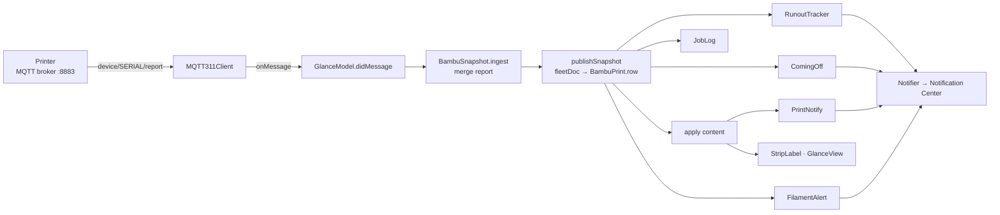
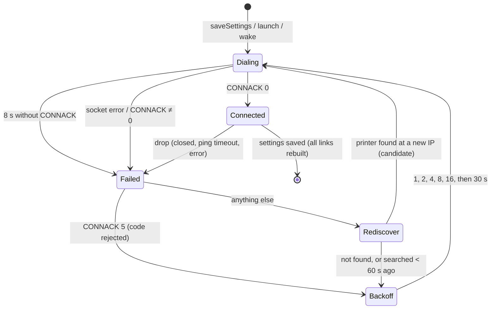

# How PrintGlance works

PrintGlance is a macOS 14+ menu bar app (SwiftUI `MenuBarExtra`, no Dock icon) that shows Bambu Lab 3D printers' progress. It talks to each printer directly over the local network with MQTT over TLS, the same LAN protocol Bambu Studio uses. It needs no Bambu account and no cloud. It watches up to four printers, explains pauses and failures, sends notifications, tracks AMS filament, and keeps a short print history.

This document is for whoever changes the code next, human or agent. Read it before changing behavior; read [TESTING.md](TESTING.md) before writing tests. The user-facing behavior is described in the [README](../README.md); `ShippingTests` fails when the README and the code disagree.

## Contents

1. [Promises that constrain every change](#promises-that-constrain-every-change)
2. [Repository map](#repository-map)
3. [From a printer report to the menu bar](#from-a-printer-report-to-the-menu-bar)
4. [Printer states](#printer-states)
5. [Online, offline, sleep](#online-offline-sleep)
6. [Connection lifecycle](#connection-lifecycle)
7. [Which printer the menu bar shows](#which-printer-the-menu-bar-shows)
8. [Notifications](#notifications)
9. [Filament: low spool and runout estimate](#filament-low-spool-and-runout-estimate)
10. [Errors: codes, reasons, lookup](#errors-codes-reasons-lookup)
11. [History](#history)
12. [Setup window](#setup-window)
13. [Discovery](#discovery)
14. [What is stored where](#what-is-stored-where)
15. [macOS integration and load-bearing workarounds](#macos-integration-and-load-bearing-workarounds)
16. [Update check](#update-check)
17. [The Python feed](#the-python-feed)
18. [Build, sign, release](#build-sign-release)
19. [Known limits and debt](#known-limits-and-debt)
20. [Changing things safely](#changing-things-safely)
21. [Bambu report fields the app reads](#bambu-report-fields-the-app-reads)

## Promises that constrain every change

These are product promises (README, "Private and read-only") or hard-won constraints. Tests guard most of them.

| Rule | Why | Guarded by |
|---|---|---|
| **Read-only.** The app publishes exactly one message: `{"pushing":{"command":"pushall","sequence_id":"0"}}` to `device/<serial>/request`. Never pause, stop, resume, print, or change settings. | The README promises it, and a bug here could ruin a print. | `SecurityTests.testOnlyEverAsksForAFullReport`, `GlanceModelTests.testHandshakeSubscribesAndAsksForEverything`, `MQTTWireTests`, Python `MqttCallbackTests` |
| **LAN only.** The app's only internet request is the daily GitHub release check. Bambu web pages open in the browser only when the user clicks **Look up**. | Privacy promise. | `ShippingTests.testReadOnlyAndLocalPromise`, `UpdateCheckTests` |
| **The access code stays on this Mac**, and only ever travels as the MQTT password to the printer's own IP. Never log it, never put it in a notification or a URL. | Privacy promise; the code grants LAN control of the printer. | `SecurityTests.testAccessCodeIsOnlyEverTheMQTTPassword` |
| **No dependencies.** The package has none; system frameworks only. | Simplicity and supply chain. | Review |
| `Printer`, `PrintDoc`, `AMSTray`, `AMSUnit`, `Temp`, `Runout` stay `Codable`; only add optional fields with `= nil` defaults. | The JSON fixtures pin the Python feed's format (`PrintDocTests`). | `PrintDocTests` |
| Don't edit `bambu.py`, `print_loop.*`, `.env*`, or launchd. | The feed runs as a LaunchAgent on the owner's Mac and may feed another device. | Review; `Tests/Feed` covers its behavior |
| Don't restructure the [load-bearing workarounds](#macos-integration-and-load-bearing-workarounds). | Each one fixes a macOS 26/27 menu bar bug that only shows with real clicks. | Manual checks in TESTING.md |
| Presentation decisions live in pure `static` functions on `GlanceContent` (report parsing on `BambuPrint`), each with tests. Views stay thin. | Every state can be tested and rendered without a printer. | `PrintDocTests`, `PrepareAmsHmsTests`, UI tests |
| Copy is English, short plain sentences. Menu items use title case ("Add Printer…"); everything else sentence case. States are **Starting, Printing, Paused, Finished, Failed, Idle, Offline**; no connection at all is **Can't reach printer**; slots are **A1…D4**, **HT-A**, **External**; codes are **Error 0700-2000-0002-0001**. | Consistent vocabulary across menu bar, card, notifications, README. | UI and shipping tests |

## Repository map

All app code is one SwiftPM executable target, `Sources/PrintGlance`.

| File | Responsibility |
|---|---|
| `PrintGlanceApp.swift` | `@main` app. Builds one `GlanceModel`, calls `start()`, declares the `MenuBarExtra` (window style) with `StripLabel` as the menu bar label and `GlanceView` as the panel. `AppDelegate` shows setup on reopen and keeps the app alive when the setup window closes. `PinMenuBarExtra` workaround. |
| `GlanceModel.swift` | The orchestrator (`@MainActor ObservableObject`). Owns one `Link` (MQTT client + `BambuSnapshot`) per complete saved printer, the connection state machine, rediscovery, and the pipeline that turns snapshots into `content` and side effects (notifications, history, runout, finishing-soon). Also `Notifier`, the Notification Center seam, and `PrintNotifyPresenter`, the notification delegate. |
| `MQTT311Client.swift` | `MQTTSession` protocol and `MQTT311Client`, a minimal MQTT 3.1.1 client on `Network.framework` over TLS: CONNECT, SUBSCRIBE (QoS 0), PUBLISH (QoS 0), PINGREQ every 20 s with a 30 s keep-alive, frame reassembly, a generation counter so a replaced socket can't fire callbacks. Backoff schedule. |
| `BambuSnapshot.swift` | `BambuJSON` (lenient number/string reading), `BambuPrint` (pure parsing of a merged report into a `Printer` row: state, progress, job label, filament, AMS trays and units, temperatures, error codes, stage), `BambuSnapshot` (one printer's merged report and its online/offline clock), `fleetDoc`. |
| `PrintDoc.swift` | The value types: `PrintDoc` (all printers), `Printer` (one row), `AMSTray`, `AMSUnit`, `Temp`, `FeedResult` (`.doc`, `.feedDown`, `.needsSetup`, `.connecting`). `PrintDoc.displayRow()` ranks printers for the menu bar. |
| `GlanceContent.swift` | Pure presentation: the menu bar strip (`StripPresentation`), headline, subtitle, hero, remaining line, layer line, filament line, heat line, offline lines, error reasons and lookup URLs, AMS grouping, history captions, time formatting (`dayTime`, `formatRemain`). `GlanceCopy` holds the can't-connect sentences. |
| `GlanceView.swift` | SwiftUI views: `GlanceView` (the panel: header, card, printer list, overflow menu), `CardHeader`, `PrinterList`, `PrinterDetail` (one printer's card body), `HistoryView`, `CapsuleBar` (progress with runout marker), `StripLabel` (menu bar label). |
| `PrintGlancePanel.swift` | `hugMenuBarPanel()` (sizes the panel window to the card), `PanelOpened` (runs a closure each time the panel opens), `MenuBarHug.frame` (pure frame math). |
| `PrintNotify.swift` | Print-state notifications: preferences (`PrintNotifyPrefs`), edge detection per printer (`PrintNotify`), duplicate suppression (`PrintNotifyStamp`), offline suppression when this Mac caused it, `PendingSelection` (a clicked notification opens that printer). |
| `ComingOff.swift` | `QuietHours` and `ComingOff`, the once-per-job "Print finishing soon" notice scheduled ahead of time. |
| `FilamentAlert.swift` | `FilamentAlert` (spool under 20%) and `RunoutTracker` (least-squares fit of AMS percent against progress to predict where a spool runs out). |
| `JobLog.swift` | Print history: opens a row when a job starts, closes it on finish/fail/idle, caps at 50, saves `jobs.json`, exports CSV. Gives the finished time for "40m ago". |
| `PrinterSettings.swift` | `PrinterSettings` (one saved printer), `SavedPrinters` (the list, focus, cap of 4, edits, persistence, legacy migration), `AccessCodeStore` (reads the 1.1.7 Keychain item once, then deletes it). |
| `PrinterDiscovery.swift` | SSDP discovery of Bambu printers on the Wi-Fi (UDP multicast), reply parsing, model code names, `ipChanges` for rediscovery. |
| `SetupView.swift` | `SetupFlow` (the Add/Edit printer state machine) and `SetupView` (its window content). |
| `SetupWindow.swift` | The `NSWindow` that hosts setup, its show/close/cancel wiring, and the Remove confirmation alert. |
| `LoginItem.swift` | Open at Login via `SMAppService.mainApp`. |
| `AppUpdate.swift` | Version comparison and GitHub release parsing (`AppUpdate`), the daily checker (`AppUpdateChecker`). |

Outside `Sources`:

| Path | What |
|---|---|
| `Tests/PrintGlanceTests` | The Swift suite (XCTest). See [TESTING.md](TESTING.md). |
| `Tests/Feed/test_feed.py` | The Python feed's suite (unittest). |
| `bambu.py`, `print_loop.py`, `print_loop.sh`, `requirements.txt`, `.env.example` | The [Python feed](#the-python-feed). Not used by the app. |
| `Info.plist` | Copied into the bundle by `make app`. Bundle ID `local.PrintGlance`, `LSUIElement`, `LSMultipleInstancesProhibited`, the Local Network usage string, the version. |
| `Makefile` | `test`, `release`, `app`, `zip`, `notarize`, `install`, `icon`, `clean`. |
| `scripts/render-appicon.swift` | Draws the app icon into `dist/AppIcon.icns`. |
| `.github/workflows/test.yml`, `release.yml` | CI tests on every PR and push to `main`; release on a `v*` tag. |
| `docs/*.png` | README screenshots. |

## From a printer report to the menu bar

1. **Receive.** `MQTT311Client` reassembles frames from the TLS socket, and hands each PUBLISH's payload to `onMessage` on the main queue.
2. **Merge.** `GlanceModel.didMessage` parses JSON (anything that isn't an object is dropped) and calls `BambuSnapshot.ingest`, which merges the `print` object into the snapshot like Bambu Studio's `json_diff`: nested objects merge key by key, arrays and values replace. Printers send a full report after `pushall`, then deltas. When `task_id`, `subtask_id`, or `subtask_name` changes, the old `layer_num`, `total_layer_num`, and `gcode_file` are dropped so a new job can't show the last one's layer.
3. **Rows.** `publishSnapshot` runs after every message, connect, disconnect, and every 5 s (so a silent printer goes offline on time). It builds a `PrintDoc` with one `Printer` per complete saved printer, in saved order, via `BambuPrint.row`. A printer that never reported is an `OFFLINE` row.
4. **Side effects, in this order:** `RunoutTracker.observe` (sets `row.runout`), `JobLog.observe` (saves `jobs.json` on change), `ComingOff.consider` (schedules or cancels "finishing soon"), `apply` (publishes `content`; `PrintNotify.observe` turns state edges into alerts), the minute clock for "40m ago" and "Last update", `FilamentAlert.consider` and the runout notice.
5. **Draw.** `GlanceModel.strip` feeds the menu bar `StripLabel`. `GlanceView` shows `PrintDoc.displayRow()` (or the printer clicked in the list during this panel visit), `PrinterDetail` for the card, and `PrinterList` when there are two or more printers. Every string comes from a `GlanceContent` function.

Before any printer has reported, `content` is `.needsSetup` (no complete printer), `.connecting` (some link not failed), or `.feedDown` (every link failed). The card shows **Add your printer**, **Connecting**, or **Can't reach printer** with the reason from `GlanceCopy.feedDownDetail`.

## Printer states

`BambuPrint.row` derives `Printer.state` from `gcode_state`:

| Report | `state` | Menu bar | Card hero / subtitle |
|---|---|---|---|
| link not trusted (see below), or empty `gcode_state` | `OFFLINE` | `wifi.slash` | Last known job, "Offline", "Last update …", what it was doing |
| `RUNNING` with `stg_cur` ≠ 0 and `layer_num` 0 | `PREPARE` | `printer.fill` + first word of the stage ("Heating") | Finish time, stage ("Loading filament"), heaters "Nozzle 186 / 220° · Bed 48 / 60°" |
| `PREPARE` | `PREPARE` | as above | as above |
| `RUNNING` | `RUNNING` | `printer.fill` + " 52%  16:25" | Finish time, time left, bar, layer, filament, runout line |
| `PAUSE` | `PAUSE` | `pause.fill` + percent | Time left (not finish time: it slides), reason, error codes, AMS |
| `FINISH` | `FINISH` | `checkmark` + "40m ago" for 2 h | "40m ago" (when PrintGlance saw it end), printer name, AMS |
| `FAILED` | `FAILED` | `xmark` | Reason, error codes, AMS |
| `IDLE` | `IDLE` | `printer` | Printer name, AMS slots |
| anything else (e.g. `SLICING`) | passed through | `printer` | The raw word |

Printers heat, level, and calibrate under `RUNNING` with layer 0 and `stg_cur` naming the stage; PREPARE itself only covers fetching the file. Both show as **Starting**. A stage after layer 0 (a filament change) stays Printing. `BambuPrint.stageLabel` maps `stg_cur` numbers to Heating, Leveling, Loading filament, Unloading filament, Calibrating, Cleaning nozzle, Homing, or Starting.

Percent is clamped to 0–100. `mc_remaining_time` (minutes) is clamped to 0–30 days. `eta` is the finish clock time formatted by `GlanceContent.dayTime`: "16:25", "16:25 tomorrow", "16:25 Mon" within 6 days, else "Sep 12"; the hour cycle follows the Mac's locale, words stay English. The menu bar pads the percent with figure spaces (U+2007) so its width doesn't change as the number grows.

Temperatures are only filled while Starting, so rows stay equal between reports while printing (equal rows mean no SwiftUI update). Newer printers pack a heater as `target << 16 | current` under `device.*`; older ones send top-level `nozzle_temper` etc. Dual-nozzle printers (H2D, X2D) report each nozzle in `device.extruder.info` and the active one in bits 4–7 of `device.extruder.state`; the card shows **Left** or **Right** next to the filament.

## Online, offline, sleep

`BambuSnapshot` decides whether a printer is online from one date, `trustedUntil`:

- Each report sets it to now + **120 s** (`BambuPrint.staleAfter`). A printer that stops talking goes Offline after two minutes.
- A dropped connection pulls it in to at most now + **30 s** (`offlineGrace`), so a quick reconnect doesn't flash Offline.
- `willSleep` freezes an online printer online (`.distantFuture`); `didWake` gives it 30 s to report again. A printer that was already offline stays offline.

An offline row keeps the last report's fields and adds `lastSeen` and `lastState`, so the card can say "Was printing · 52% · Layer 18 / 29" and "Expected to finish 16:25". `lastSeen` is nil while online so rows stay equal between messages.

## Connection lifecycle

`GlanceModel` keeps one `Link` per complete saved printer, keyed by serial. The details that matter:

- **Dial.** `beginConnect` dials `<ip>:8883` with client ID `pg-app-<last 6 of serial>-<random per-launch hex>`, user `bblp`, password = access code. The Python feed uses `pg-feed-…`; two sessions with one ID make the printer drop each in turn.
- **Handshake.** On CONNACK 0, `didConnect` saves the candidate IP if this dial was one, subscribes to `device/<serial>/report`, and publishes `pushall`.
- **Timeout.** 8 s without CONNACK marks the link failed with reason `connect timed out`, closes the socket, and asks for rediscovery.
- **Drop.** `didDisconnect` marks the link failed with the client's reason: `MQTT CONNACK <n>`, `ECONNREFUSED`, `closed`, `ping timeout`, `malformed packet`, or a Network.framework error string. The snapshot gets its 30 s grace.
- **Code rejected** (`MQTT CONNACK …`, see `GlanceCopy.codeRejected`): the printer answered at that IP, so no search; back off and retry. The card offers **Update Access Code…**.
- **Rediscovery.** Otherwise the printer may have a new DHCP address. One SSDP scan (4 s) runs at most once a minute and serves every waiting link. If a saved serial answers from a different IP, that IP becomes the link's *candidate* and is dialed at once; it's saved to preferences only after CONNACK, and reverted if that dial fails. A printer open in the setup window is skipped (`setRediscoverPausedSerial`), because the window owns its IP while open. Links that reconnected while the scan ran are left alone.
- **Backoff.** `MQTT311Client.reconnectDelaySeconds`: 1, 2, 4, 8, 16, then 30 s. The attempt counter resets only after a session that lasted 30 s, so accept-then-drop keeps backing off.
- **Status.** `linkStatus[serial]` is `.connecting`, `.connected`, or `.failed(reason)`. A failed link stays `.failed` through retries until a connect succeeds (see workarounds). The setup window watches it.
- **Sleep and wake.** `willSleep` freezes snapshots; `didWake` reconnects every link immediately (failed, non-rejected links rediscover first) and checks for updates.
- **Settings change.** `saveSettings` tears down every link (callbacks cleared, socket closed) and builds new ones. Focus changes don't.
- **Generations.** `MQTT311Client` bumps a generation on every connect, disconnect, and failure; callbacks from an older socket are ignored. A cancelled socket can never fail the attempt that replaced it.

## Which printer the menu bar shows

`PrintDoc.displayRow()` picks the printer that needs you:

1. Paused
2. Printing or Starting: the focused one, else the one finishing soonest
3. Failed
4. Finished
5. Anything else: the focused one, else the first saved

Focus (`SavedPrinters.focusId`) is set when the user clicks a printer in the list; it only breaks ties. A failed printer doesn't take the menu bar from a printing one, because the failure notification already told the user and live progress is more useful.

The panel opens on the menu bar's printer each time. Clicking a list row changes the card for that visit only (`GlanceView.selectedId`), and sets focus. A clicked notification sets `PendingSelection`, and the next panel open shows that printer once.

## Notifications

All notifications go through `GlanceModel.post` → `Notifier.add` and carry the printer's serial in `userInfo["serial"]`.

| Notice | Trigger | Identifier | Default | Quiet Hours |
|---|---|---|---|---|
| Print finished | `RUNNING`/`PREPARE` → `FINISH` | `pg.finish.<serial>` | on | Delayed to 7 AM (`UNCalendarNotificationTrigger`) |
| Print failed | `RUNNING`/`PREPARE` → `FAILED` | `pg.fail.<serial>` | on | Delivered |
| Print paused | `RUNNING`/`PREPARE` → `PAUSE` | `pg.pause.<serial>` | on | Delivered |
| Lost connection | `RUNNING`/`PREPARE`/`PAUSE` → `OFFLINE` | `pg.offline.<serial>` | on | Delivered |
| Print finishing soon | Scheduled lead time before the end of a `RUNNING` job | `pg.comingoff.<serial>.<jobId>` | on, 10 min | Skipped if it would fire in the window |
| Low filament | Active spool < 20% while Starting or Printing | `filament.<serial>\|<tray>\|<task>` | on | Delivered |
| Filament may run out | First runout estimate per job and slot | `runout.<serial>.<jobId>.<slot>` | on (with Low Filament) | Delivered |

- **Edges, per printer.** `PrintNotify` remembers each printer's last state, so focus changes and adding a printer aren't print edges. `.connecting` and `.needsSetup` change nothing.
- **Duplicates.** A `PrintNotifyStamp` (serial, state, job) is saved per printer after each alert; the same alert for the same job isn't repeated, across relaunches too. A new `RUNNING` clears it.
- **Reasons.** Pause and fail bodies start with a plain reason when the code is known ("Filament ran out in AMS A, slot 1.") and end with "· Error <code>".
- **Lost connection** isn't sent while this Mac has no network, or for 2 minutes after its network changes (`NWPathMonitor` in `start()`), because then the Mac lost the printer, not the other way round.
- **Finishing soon** is scheduled once per job as a time-interval notification at `remaining − lead`. It is rescheduled only when the remaining time jumps by more than 2 minutes or the lead time changes. Pause or Offline cancels it until printing resumes; Finish, Failed, or Idle cancels it for good. Inside the lead time it fires at once and says what's actually left.
- **Permission** is requested on the first Starting or Printing report each launch (not on Finish, so the prompt can't eat that alert), and after the first printer is set up. If notifications are off in System Settings, the Notifications menu starts with **Notifications Are Off…**.
- **Presentation.** `PrintNotifyPresenter` shows banners while the app is frontmost (a menu bar app always is), and turns a click into `PendingSelection`.
- **Pause default migration.** Pause alerts became default-on; `pg.notify.pauseOn.v1` turns them on once for older installs.

## Filament: low spool and runout estimate

`BambuPrint.activeFilament` finds the spool in use from `ams.tray_now` (or `tray_tar`): 255 is none, 254 is the external spool (`vt_tray`), otherwise a global index where AMS A is 0–3, AMS B 4–7, and so on. The filament name prefers `tray_sub_brands`, then a table of Bambu SKUs from `tray_info_idx` ("GFA01" → "PLA Matte"), then `tray_type`. Remaining percent below 0 means no RFID reading.

**Low filament.** `FilamentAlert` fires once per printer, slot, and job when the active spool is under 20% while Starting or Printing.

**Runout.** `RunoutTracker` fits a least-squares line to each spool's AMS percent against print progress (`mc_percent`), one reading per whole percent, and predicts the progress at which it reaches 0. Progress, not time, so pauses and speed changes don't skew it. It needs 5 readings, a slope clearly below flat (two standard errors), and won't guess further ahead than three times the progress it has measured. Readings under 5% are left out: the AMS estimate swings by a couple of points near empty and can read 0% with filament left (measured on an X2D). A rise of 10 points or a different filament or color in the slot is a new spool. The earliest runout before 100% becomes `row.runout`: the card draws an orange notch on the bar and a line such as "PLA Matte in A2 runs out around 15:45." ("is about to run out" under 5 minutes; no time while paused), and names another slot with the same filament and color that AMS backup may switch to. State is saved under `pg.runout` so a relaunch mid-print keeps the fit.

## Errors: codes, reasons, lookup

Only paused and failed printers show codes (`print_error` can linger after the problem is gone).

- **HMS** (`hms[]`): the first non-zero `attr`/`code` pair, formatted `AAAA-BBBB-CCCC-DDDD`.
- **print_error**: a non-zero integer formatted `%08X` with a dash after four digits, `0300-806E`, like Bambu Studio.
- **Reasons**: `GlanceContent.errorReason(code:)` knows about 30 common codes in both forms. AMS codes carry the unit in the first group's low byte and, for feed and filament parts, the slot in the second group, so one table row covers every unit and slot ("Filament ran out in AMS B, slot 3."). Unknown codes show only "Error <code>".
- **Look up**: HMS codes open `e.bambulab.com` with the code and the serial's first three characters (the model, not the printer). `print_error` codes open Bambu's wiki table with a text fragment and copy the code to the clipboard.

## History

`JobLog` opens a row when a printer starts a job (Starting or Printing) and closes it when it finishes (ok), fails (fail), or goes idle (ok, no end time). A new job ID while a row is open closes the old row. `endedAt` is set only if PrintGlance saw the job running, so "took 4h 43m" is never a guess. Up to 50 rows are kept (the oldest closed rows go first; an open row never does) in `~/Library/Application Support/PrintGlance/jobs.json`; History shows them newest first and exports CSV (`started,ended,duration_min,printer,job,filament,outcome`, RFC 4180 quoting). The newest successful row's `endedAt` gives the menu bar's "40m ago".

## Setup window

`SetupWindow` hosts `SetupView` in its own `NSWindow` (the menu bar panel closes when the user walks to the printer to read the code). It opens on first launch, on reopen while nothing is set up, from **Add Printer…** and **Edit …** in the panel's menu, and from **Update Access Code…**.

`SetupFlow` phases: `form` → `connecting` → `connected` (closes after 1 s) or `welcome` (first printer) or `failed(message)`.

1. On open it scans the Wi-Fi (`PrinterDiscovery`). No results opens **Enter IP and serial instead**. A printer already saved shows **Added** and can't be picked. Picking fills IP, serial, and a suggested name (a typed name is kept).
2. **Connect** saves the printer through `GlanceModel.saveSettings` (so the real link dials it) and watches `linkStatus` for that serial. Success ends the wait; a failure shows why and offers **Try Again**; a later success still counts (rediscovery may find the printer at a new IP). After 20 s with no answer it says so.
3. Every attempt starts from the printer list as it was before the first Connect, so retries replace the attempt instead of adding rows. **Cancel**, Esc, ⌘W, and the close button restore that list.
4. Editing a printer pauses its rediscovery until the window closes.
5. The welcome step offers **Open at login** (on by default; macOS may require approval in Login Items), then asks for notification permission.

## Discovery

`PrinterDiscovery.scan` sends an SSDP `M-SEARCH` for `urn:bambulab-com:device:3dprinter:1` to `239.255.255.250` on UDP ports 1990 and 2021 from sockets bound to those ports (with `SO_REUSEPORT`, so it works while Bambu Studio holds them) and to an ephemeral port, and collects replies for 4 s. `parse` accepts a reply only if it looks like Bambu's (NT/ST mention bambulab, or it has `DevName`/`DevModel`), and only if `Location` is a plain IPv4 address that isn't multicast, broadcast, or `0.0.0.0`. The serial comes from `USN`; model codes map to marketing names ("N6" → "X2D"). Access codes are never in the packets. macOS asks for Local Network permission the first time (the string is in `Info.plist`).

## What is stored where

Preferences live in the `local.PrintGlance` domain (`UserDefaults.standard` in the app; tests inject a scratch domain).

| Key or file | Contents |
|---|---|
| `printers` | Array of `{ip, serial, name, accessCode}`. The access code is stored here in plain preferences on purpose: 1.1.7 used the Keychain, and ad-hoc signed updates made macOS prompt for it on every launch. |
| `printerFocusId` | The focused serial. |
| `printerIP`, `printerSerial`, `printerAccessCode`, `printerName` | Pre-multi-printer settings, migrated into `printers` on first load. `make install` writes them from `.env`. |
| Keychain `local.PrintGlance.accessCode` | 1.1.7's access codes. Copied onto the row once, then deleted. |
| `pg.notify.finish`, `.fail`, `.pause`, `.offline`, `.comingOff`, `.quietHours`, `.lowFilament`, `.comingOffLead` | Notification preferences. |
| `pg.notify.pauseOn.v1` | One-time migration flag. |
| `pg.notify.stamps` (and legacy `pg.notify.stamp.*`) | Duplicate-alert stamps per printer. |
| `pg.comingoff.phase`, `pg.comingoff.remain` | Finishing-soon state per printer and job (`remain` holds the scheduled delay; the name predates lead times). |
| `pg.runout` | `RunoutTracker` as JSON. |
| `pg.update.lastCheck`, `.remoteTag`, `.remoteZip` | Update check cache. |
| `~/Library/Application Support/PrintGlance/jobs.json` | History. |
| `~/Library/Logs/PrintGlance.log` | Connection log (connects, drops, IP changes, skipped alerts). Wiped at launch when over 1 MB. Serials and IPs appear here; access codes never do. |

Changing `CFBundleIdentifier` orphans all of the above.

## macOS integration and load-bearing workarounds

Each of these fixes a real bug on macOS 26 (Tahoe) or 27 that only shows in the running app. Don't restructure them; changing the strip's image name or title text is fine.

| Where | What it works around |
|---|---|
| `PinMenuBarExtra` (`PrintGlanceApp.swift`) | Tahoe parks an unnamed extra at x≈80, under the front app's menus. Moves the status item window right. |
| No `.id(strip)` on the label | On macOS 26 recreating the extra makes it vanish from the bar for good. |
| `hugMenuBarPanel` / `HugWindowView` (`PrintGlancePanel.swift`) | The window-style extra leaves a clear band above and below the card, and its minimum size lags a turn behind, so a shrinking card left the panel tall. Snaps the window to the card's size on every resize, keeping the top-right corner and the system frost. |
| `PanelOpened` | There's no "panel opened" callback; watches the window becoming key. Resets the card to the menu bar's printer, closes History, refreshes Open at Login and notification status. |
| "Keep `failed` through retries" in `GlanceModel.beginConnect` | Publishing `.connecting` on every retry remounted the extra as the plain printer icon on Tahoe, so the icon flashed. |
| `Notifier` and the nonisolated permission call | Calling `requestAuthorization` with a MainActor completion traps (SIGTRAP) and the extra vanishes; `UNNotificationSettings` isn't Sendable in the macOS 15 SDK. Notification Center also traps in any process without an app bundle, which is why tests inject a `Notifier`. |
| `SetupNSWindow` | Esc and ⌘W close (and cancel) whatever has focus. |
| `AppDelegate.applicationShouldTerminateAfterLastWindowClosed` → false | Closing the setup window must not quit a menu bar app. |
| `LSMultipleInstancesProhibited` | Two copies would hold two sessions per printer. |

Live testing notes: on macOS 27 `NSStatusBarButton.performClick` doesn't open a window-style extra, and computer-use tools can't target a menu-bar-only app. A shell-driven debug hook opens the panel without making it key, which hides timing bugs that real clicks show. For UI timing bugs, run a logging build from `dist/` and click for real (see TESTING.md).

## Update check

`AppUpdateChecker` asks `https://api.github.com/repos/talic/PrintGlance/releases/latest` at most once a day (an hourly loop checks whether a day has passed, and wake checks too) with an ephemeral session, an 8 s timeout, and a `User-Agent` of `PrintGlance/<version> (+https://github.com/talic/PrintGlance)`. A newer `tag_name` shows **Update available** in the card and **Download PrintGlance <version>** in the menu. The download link is the release's `PrintGlance.zip` asset only if it is an `https://github.com/` URL; otherwise the release page. A failed check publishes what it knew and doesn't count as the day's check. There is no auto-update.

## The Python feed

`bambu.py` and `print_loop.py` predate the Swift app's direct MQTT client. The app no longer reads them, but the owner runs `print_loop.sh` as the LaunchAgent `local.PrintGlance.feed`, and another device may read it. It connects to one printer from `.env` (`BAMBU_IP`, `BAMBU_SERIAL`, `BAMBU_ACCESS_CODE`, `BAMBU_NAME`) with client ID `pg-feed-…`, merges reports like the app, and serves `GET /print.json` (and `/print`, `/health`, `/`) on `PRINT_HOST:PRINT_PORT` (default `0.0.0.0:8080`), optionally requiring the `X-Stats-Token` header when `STATS_TOKEN` is set. The JSON is the `PrintDoc` shape in snake_case; `Tests/PrintGlanceTests/Fixtures/*.json` pin it. Leave these files alone unless the owner asks.

## Build, sign, release

- `make test` runs the Swift suite and the feed's suite. On the owner's Mac `xcode-select` points at the Command Line Tools, which lack XCTest and the SwiftUI macros, so the Makefile exports `DEVELOPER_DIR=/Applications/Xcode.app/Contents/Developer`. Bare `swift test` fails there.
- `make app` builds release, assembles `dist/PrintGlance.app` with `Info.plist` and the icon, and signs ad-hoc (`SIGN_ID=-`). `make zip` zips it. `make notarize` signs with a Developer ID (hardened runtime, timestamp), submits to notarytool, checks the status, staples, and re-zips.
- `make install` quits the running app, copies it to `~/Applications`, **rewrites saved printers from `.env`**, and opens it. Don't run it without asking.
- **CI** (`test.yml`): `swift test` and the feed tests on `macos-15` with Xcode 16.4 (Swift 6.1, macOS 15.5 SDK). That toolchain is older than a current Mac's, and Swift 6 concurrency checks differ: code that crosses actors with Apple framework types can build locally and fail in CI. Keep non-Sendable framework values inside nonisolated helpers and return plain values. The PR's CI is the real check.
- **Release** (`release.yml`): on a `v*` tag that must equal `v` + `CFBundleShortVersionString`, runs tests, imports the Developer ID certificate if the secrets exist, builds, notarizes, checks Gatekeeper, and attaches `PrintGlance.zip` to the GitHub release. Without signing secrets it ships ad-hoc (a marked `ponytail:` fallback; turn it back into an error once the secrets exist). The README keeps its "Open Anyway" steps until a notarized release is the latest.
- Bump `CFBundleShortVersionString` and `CFBundleVersion` in `Info.plist` for a release.

## Known limits and debt

Deliberate shortcuts carry a `ponytail:` comment in the code naming the ceiling and the upgrade path. Run `/ponytail-debt` (or grep `ponytail:`) for the live list. Notable ones:

- **TLS trusts any certificate** (`MQTT311Client.connectOnQueue`). The printer's certificate is signed by Bambu's own CA, so a device on the LAN could impersonate a printer and read the access code. Upgrade: pin Bambu's CA. `MQTTWireTests.testAcceptsAnySelfSignedCertificate` pins today's behavior so a change is deliberate.
- **Four printers** (`SavedPrinters.maxCount`). A farm view is the upgrade.
- **Error reasons** cover about 30 common codes; add rows as codes show up.
- **The filament SKU table** is static; add a row when a Bambu ID shows as generic PLA.
- **Runout treats 0% as empty**, though an X2D printed on at 0%. Weighing spools at 0% would let an offset per AMS model move the guess.
- **The log** is wiped at 1 MB rather than rotated.
- **Release signing** falls back to ad-hoc without secrets.

Open findings from building the test suite (not fixed; see TESTING.md for detail): CSV export doesn't neutralize cells starting with `=`, `+`, `-`, `@` (spreadsheet formula injection from a crafted job name); the MQTT client buffers a frame up to the 256 MB the length field allows; the keep-alive ping (20 s) isn't covered by automated tests; several Python feed issues (a report with `Infinity` or deep nesting can break it; it serves the LAN without a token by default; `tray_now` across several AMS units is read wrong).

## Changing things safely

1. Read the code you touch and its tests. Trace the real flow end to end (report → `BambuPrint.row` → `GlanceContent` → view) before deciding where a change goes.
2. Put decisions in pure functions (`GlanceContent`, `BambuPrint`, the small value types) and test them with fixed `now`, `Calendar`, and `Locale`.
3. For anything that touches connections, notifications, or persistence, add a `GlanceModelTests` workflow using `ModelHarness`.
4. For anything visible, add or update a UI test (`Tests/PrintGlanceTests/UI`) that reads the screen through accessibility, and render the states with `PG_RENDER_DIR=<dir> make test` to look at them in light and dark.
5. If the README describes the behavior, update it and `ShippingTests` together.
6. Run `make test`. Watch the PR's CI for Swift 6.1 concurrency errors.
7. Commit messages: `type: short imperative summary`, lower case (`feat:`, `fix:`, `refactor:`, `test:`, `docs:`, `build:`, `chore:`).

## Bambu report fields the app reads

All under the report's `print` object.

| Field | Meaning | Used for |
|---|---|---|
| `gcode_state` | `IDLE`, `PREPARE`, `RUNNING`, `PAUSE`, `FINISH`, `FAILED`, … | State |
| `stg_cur` | Current stage number; 0 is printing | Starting vs Printing, stage word |
| `mc_percent`, `mc_remaining_time` | Progress %, minutes left | Bar, hero, ETA, runout x-axis |
| `layer_num`, `total_layer_num` | Layer progress | Layer line, Starting detection |
| `task_id`, `subtask_id` | Job identity | Job changes, history, dedupe |
| `subtask_name`, `gcode_file` | Job name, file path | Job label (cache paths and hex names ignored, process suffix like "0.2mm layer" cut, 40 chars) |
| `ams.tray_now` / `tray_tar` | Active slot (255 none, 254 external) | Active filament |
| `ams.ams[].id`, `.humidity`, `.humidity_raw`, `.info`, `.tray[]` | AMS units (HT from id 128) and slots | Trays, humidity, runout |
| `tray[].tray_type`, `tray_sub_brands`, `tray_info_idx`, `remain`, `tray_color`, `cols` | Slot contents | Filament name, %, color dot |
| `vt_tray`, `vir_slot[]` | External spool(s); dual-nozzle printers send two | External slots |
| `device.extruder.state`, `.info[].temp` | Nozzle count and active nozzle, packed temps | Left/Right, nozzle temp |
| `device.bed.info.temp`, `device.ctc.info.temp` | Packed bed and chamber temps | Heat line |
| `nozzle_temper`, `nozzle_target_temper`, `bed_temper`, `bed_target_temper`, `chamber_temper`, `ctt` | Older printers' temps | Heat line |
| `hms[]` (`attr`, `code`) | Health management codes | Error codes and reasons |
| `print_error` | Print error integer | Error codes and reasons |
